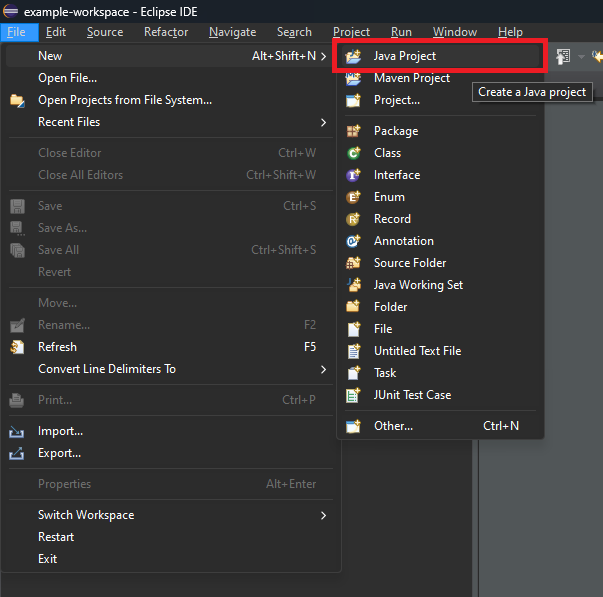

# Transmisión Electrónica de Datos(TED) - Listar Buzón

[Más informacion sobre el API](https://apiportal.mercantilbanco.com/mercantil-banco/produccion/product/24422)

### Índice
    
1. [Ejemplo de encriptación](./src/com/bancomercantil/crypto/AES.java)
2. [Ejemplo de petición](./src/com/bancomercantil/app/App.java)
3. [Ejemplo práctico](#playground) 
3.1 [Configuración y uso del ejemplo](#example-config) 
3.2 [Paso a paso de una ejecución simple](#example) 
4. [Dependencias](#dependecies)
5. [Request y Response](#rq)
6. [Códigos de error](#error-codes)

## Ejemplo práctico

### Configuración y uso del ejemplo práctico

1. Descargar el código ubicado en este repositorio en su ordenador [pulsando aquí](https://github.com/apimercantil/TED/releases/download/V1/listar-buzon.zip). 

2. Descomprimir el archivo descargado en su ordenador. 

3. Abrir con un IDE de su preferencia(NetBeans, Eclipse) el archivo **App.java** ubicado en la carpeta app del ejemplo. 

4. Configurar sus credenciales en el archivo **App.java** (Utilizar las credenciales suministradas por Mercantil Banco). 

5. Configurar las [dependencias](#dependecies) del proyecto. (Puede usar cualquier herramienta de automatización para el manejo de las dependencias si así lo desea.) 
    5.1. [Gson 2.9.0](https://mvnrepository.com/artifact/com.google.code.gson/gson/2.9.0) 

6. Utilizar los archivos con la estructura suministrada por Mercantil Banco para ejecutar las pruebas del API TED. 

### Ejecución simple con Eclipse IDE Y Java 8

1. Crear un nuevo proyecto Java desde el Eclipse IDE. 
 
 

2. Descargar el código ubicado en este repositorio en su ordenador [pulsando aquí](https://github.com/apimercantil/TED/releases/download/V1/listar-buzon.zip). 

3. Descomprimir el archivo descargado en su ordenador. 

4. Copiar la carpeta **com** ubicada en la carpeta **src** del archivo descomprimido previamente. 

5. Pegar la carpeta en el proyecto creado en pasos anteriores. 
 

6. Descargar las [dependencias](#dependecies) del proyecto (En este caso se guardan en una carpeta nueva **lib**). 
 

7. Configurar las [dependencias](#dependecies) del proyecto. 
 
 

8. Configurar las credenciales suministradas por Mercantil Banco en el archivo  **App.java** ubicado en el paquete **com.bancomercantil.app** en la carpeta **src** del proyecto. 
 

9. Ejecutar el proyecto. 
 

## Información sobre el API y el ejemplo

### Dependencias
1. [Gson 2.9.0](https://mvnrepository.com/artifact/com.google.code.gson/gson/2.9.0) (JSON Serializer) 

### Request y Reponse

 
 

Para información detallada sobre los campos del request pulsa [aquí](https://www.mercantilbanco.com/mercprod/apiportal/pdfs/api_ted_descripcion_de_atributos_y_campos_cargar_archivo_1.pdf)

### Códigos de error

Para información detallada sobre la lista de errores pulsa [aquí](https://www.mercantilbanco.com/mercprod/apiportal/pdfs/api_ted_tipo_de_errores_1.pdf).
